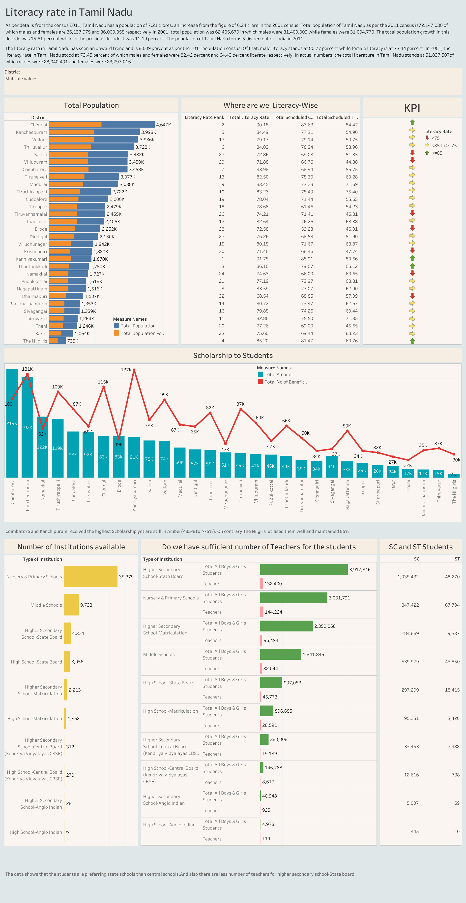

# Literacy-Rate-in-Tamil-Nadu

## Introduction

This ia a Tableau project on Literacy rate in Tamil Nadu. The objective of the project is to analyze and discover insights on the factors affecting literacy rate using interactive dashboard.

## Data Visualization 

See the [Interactive Dashboard](https://public.tableau.com/app/profile/tableau7010) live on my Tableau Public Profile

